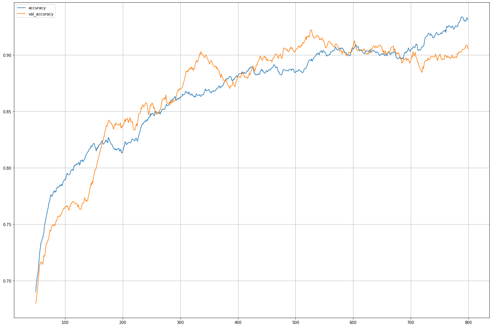

### Klasyfikator binarny obrazów

  <table border="0" style='border: none;'>
    <tr>
      <td></td>
      <td>vs </td>
      <td></td>
    </tr>
  </table>

Prosta konwolucyjna sieć neuronowa z zastosowaniem augmentacji do rozpoznawania samolotów F15 Eagle i SU-27

<ul>
  <li><a href='aircraft_cnn.ipynb'>Kod w JupyterNoteboook</a>
      <li>

</ul>

<b>Dokładność w funkcji epok</b> 

